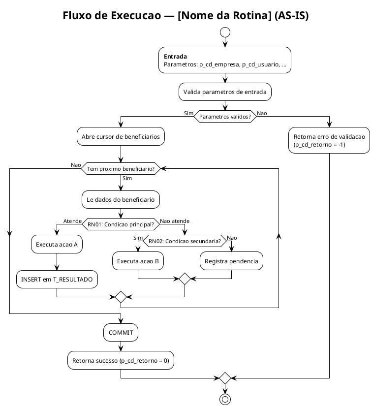
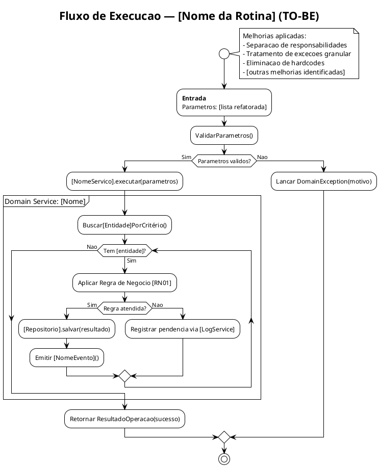

# Referencia: Etapas 3 e 4 — Diagramas C4 e Fluxogramas

---

## Etapa 3 — Diagramas C4 (PlantUML)

### Principios

O modelo C4 organiza a arquitetura em 4 niveis de zoom:

| Nivel | Diagrama | Escopo | Onde fica no projeto |
|---|---|---|---|
| 1 | System Context | O sistema inteiro e seus usuarios/sistemas externos | `_shared/c4-model/src/` |
| 2 | Container | Aplicacoes, bancos, servicos dentro do sistema | `rotinas/[nome]/03-c4-model/src/` |
| 3 | Component | Componentes dentro de um container (procedures, packages) | `rotinas/[nome]/03-c4-model/src/` |
| 4 | Code | Classes, funcoes (opcional — raramente usado) | N/A neste projeto |

**Regra:** O nivel 1 e compartilhado — nunca duplicar por rotina. Niveis 2 e 3 sao por rotina.

---

### Convencao de Nomenclatura dos Arquivos

```
c4-1-system-context.puml          ? nivel 1 (em _shared/)
c4-2-container-as-is.puml         ? nivel 2, situacao atual
c4-2-container-to-be.puml         ? nivel 2, situacao futura
c4-3-component-[nome].puml        ? nivel 3, por componente principal
```

---

### Template PlantUML — C4 Nivel 2 (Container)

```plantuml
@startuml c4-2-container-[nome]-as-is
!include https://raw.githubusercontent.com/plantuml-stdlib/C4-PlantUML/master/C4_Container.puml

LAYOUT_WITH_LEGEND()

title Diagrama de Container — [Nome da Rotina] (AS-IS)

Person(usuario, "Operador / Sistema", "Quem dispara a rotina")

System_Boundary(sigo, "SIGO") {
    ContainerDb(oracle, "Oracle Database", "Oracle 19c", "Schema principal do SIGO")
    Container(proc_principal, "[nome_da_procedure]", "PL/SQL Procedure", "Descricao do que faz")
    Container(proc_auxiliar, "[nome_auxiliar]", "PL/SQL Procedure", "Sub-rotina chamada")
}

System_Ext(sistema_ext, "Sistema Externo", "Se houver integracao")

Rel(usuario, proc_principal, "Chama", "via aplicacao / job / API")
Rel(proc_principal, proc_auxiliar, "Chama")
Rel(proc_principal, oracle, "Le e escreve", "T_BENEFICIARIO, T_PROPOSTA, ...")
Rel(proc_principal, sistema_ext, "Integra com", "Se aplicavel")

@enduml
```

---

### Template PlantUML — C4 Nivel 3 (Component)

```plantuml
@startuml c4-3-component-[nome]
!include https://raw.githubusercontent.com/plantuml-stdlib/C4-PlantUML/master/C4_Component.puml

LAYOUT_WITH_LEGEND()

title Diagrama de Componente — [Nome da Rotina]

Container_Boundary(proc_principal, "[nome_da_procedure]") {
    Component(validacao, "Bloco de Validacao", "PL/SQL Block", "Valida parametros de entrada e pre-condicoes")
    Component(regra_negocio, "Motor de Regras", "PL/SQL Cursor/Loop", "Aplica as regras RN01..RNxx")
    Component(persistencia, "Persistencia", "INSERT/UPDATE", "Grava resultados nas tabelas de destino")
    Component(tratamento_erro, "Tratamento de Excecoes", "EXCEPTION block", "Loga e trata erros")
}

Rel(validacao, regra_negocio, "Passa controle apos validacao")
Rel(regra_negocio, persistencia, "Envia dados validados")
Rel(regra_negocio, tratamento_erro, "Em caso de erro")

@enduml
```

---

## Etapa 4 — Fluxogramas de Decisao (PlantUML)

### Objetivo

- **Fluxo AS-IS:** documenta o comportamento ATUAL da rotina PL/SQL, incluindo toda a logica de decisao, loops e sub-rotinas — servindo como validacao da engenharia reversa
- **Fluxo TO-BE:** documenta o comportamento ESPERADO apos a refatoracao, ja incorporando as melhorias de design identificadas

### Convencao de Nomenclatura

```
fluxo-[nome]-as-is.puml     ? fluxo atual (derivado da engenharia reversa)
fluxo-[nome]-to-be.puml     ? fluxo refatorado (derivado do DDD + decisoes de design)
```

---

### Template PlantUML — Fluxograma AS-IS



---

### Template PlantUML — Fluxograma TO-BE



---

## Checklist de Entrega — Etapas 3 e 4

### Etapa 3 — C4
```
[ ] C4 nivel 1 existente em _shared/ revisado e atualizado se necessario
[ ] C4 nivel 2 AS-IS gerado (container-as-is.puml)
[ ] C4 nivel 2 TO-BE gerado (container-to-be.puml)
[ ] C4 nivel 3 gerado para componente principal
[ ] Todos os .puml salvos em: rotinas/[nome]/03-c4-model/src/
[ ] SVGs exportados para: rotinas/[nome]/03-c4-model/svg/
[ ] README.md raiz atualizado (C4 = ?)
```

### Etapa 4 — Fluxos
```
[ ] Fluxo AS-IS gerado — cobre TODOS os caminhos da engenharia reversa
[ ] Fluxo TO-BE gerado — incorpora melhorias do DDD e decisoes de design
[ ] Validacao: cada RN da Etapa 1 aparece em algum decision diamond do AS-IS
[ ] Todos os .puml salvos em: rotinas/[nome]/04-fluxos/src/
[ ] SVGs exportados para: rotinas/[nome]/04-fluxos/svg/
[ ] README.md raiz atualizado (Fluxos = ?)
```