# Fluxograma de Execucao por Contexto Delimitado

## `humaster.pr_cadastramento_empresa_prov` — Fluxo Completo

> **Referencia:** `REGRAS-DE-NEGOCIO-POR-CONTEXTO.md`
> **Data:** 2026-03-11
> **Procedure analisada:** `humaster.pr_cadastramento_empresa_prov` (~5.000 linhas PL/SQL)

---

## Indice dos Diagramas

| # | Diagrama | Escopo |
|---|---|---|
| 1A | Entrada e Pre-condicoes | `pr_efetiva_internet` (externo) |
| 1B | Validacoes Camada 4 | BC-02 + BC-05 + BC-06 |
| 1C | Cadastro da Pessoa e Endereco | BC-03 + BC-04 |
| 1D | Precificacao e Contrato | BC-07 + BC-08 |
| 1E-A | Coparticipacao e Fatores | BC-09 |
| 1E-B | Carencia, Fidelizacao e Termos | BC-10 + BC-11 + BC-15 + BC-16 |
| 1F | Acesso, COMMIT e Pos-COMMIT | BC-12 + BC-14 + BC-17 + BC-18 + BC-13 |
| 2A | BC-02 detalhe (parte 1) | Validacoes V01 a V17 — Vendedor, CNPJ, Textos, CEP/UF |
| 2B | BC-02 detalhe (parte 2) | Validacoes V18 a V34 — Endereco, Email, Contato |
| 3 | BC-06 detalhe | Resolucao do Modelo de Negocio SIGO x BITIX |
| 4 | BC-01 detalhe | Tratamento de Erros e Rollback |

---

## Diagrama 1A — Entrada e Pre-condicoes (pr_efetiva_internet)

> Escopo externo — executado antes de chamar `pr_cadastramento_empresa_prov`.

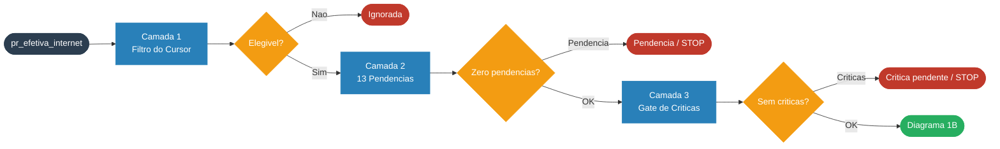

---

## Diagrama 1B — Validacoes (BC-02, BC-05, BC-06)

> Inicio da `pr_cadastramento_empresa_prov`. Validacoes Camada 4 + Filial + Modelo.

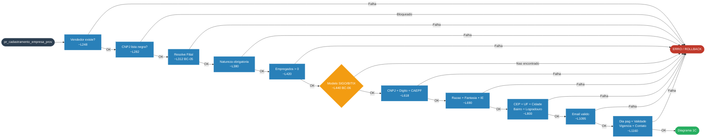

---

## Diagrama 1C — Cadastro de Pessoa e Endereco (BC-03, BC-04)

> Inicio do bloco transacional. PJ + endereco + comunicacao.

```mermaid
flowchart LR
    classDef cls-ini fill:#2c3e50,color:#fff,stroke:#2c3e50
    classDef cls-val fill:#2980b9,color:#fff,stroke:#2980b9
    classDef cls-dec fill:#f39c12,color:#fff,stroke:#f39c12
    classDef cls-ok fill:#27ae60,color:#fff,stroke:#27ae60

    INICIO(["BC-03 Pessoa Juridica"]):::cls-ini
    PJ_EXISTE{"tb_pessoa\nexiste?"}:::cls-dec
    PJ_INSERT["INSERT tb_pessoa"]:::cls-val
    PJ_UPDATE["UPDATE tb_pessoa"]:::cls-val
    AFFIX_END{"Contrato AFFIX?"}:::cls-dec
    END_REUSO["Reutiliza endereco\nexistente"]:::cls-val
    END_INSERT["INSERT tb_endereco_pessoa\n(tipo 2 - comercial)"]:::cls-val
    END_VINCULO["INSERT tb_empresa_endereco\n(tipo 1 - fatura)"]:::cls-val
    CONTATO["INSERT tb_contato_pessoa"]:::cls-val
    MEIOS["INSERT tb_meio_comunicacao_pessoa\nfone/fax/celular/email/..."]:::cls-val
    PROXIMO(["Diagrama 1D"]):::cls-ok

    INICIO --> PJ_EXISTE
    PJ_EXISTE -- "Nao" --> PJ_INSERT --> AFFIX_END
    PJ_EXISTE -- "Sim" --> PJ_UPDATE --> AFFIX_END
    AFFIX_END -- "Sim" --> END_REUSO --> END_VINCULO
    AFFIX_END -- "Nao" --> END_INSERT --> END_VINCULO
    END_VINCULO --> CONTATO --> MEIOS --> PROXIMO
```

---

## Diagrama 1D — Precificacao e Contrato (BC-07, BC-08)

> Criacao da tabela de precos e do registro principal da empresa conveniada.

```mermaid
flowchart LR
    classDef cls-ini fill:#2c3e50,color:#fff,stroke:#2c3e50
    classDef cls-val fill:#2980b9,color:#fff,stroke:#2980b9
    classDef cls-dec fill:#f39c12,color:#fff,stroke:#f39c12
    classDef cls-ok fill:#27ae60,color:#fff,stroke:#27ae60

    INICIO(["BC-07 Precificacao"]):::cls-ini
    TAB_GERAL{"Tabela geral\ncompartilhada?"}:::cls-dec
    TAB_REUSO["Reutiliza tabela AFFIX"]:::cls-val
    TAB_CRIA["INSERT tb_preco_plano"]:::cls-val
    TAB_AGREG{"Tem agregados?"}:::cls-dec
    TAB_AGR["INSERT tb_preco_plano\n(agregados)"]:::cls-val
    TAB_VAL["INSERT tb_valor_plano"]:::cls-val
    TAB_DESC{"Tem descontos?"}:::cls-dec
    TAB_DESC_I["INSERT tb_desconto_preco_plano"]:::cls-val
    TAB_FRAN["INSERT tb_parametro_franquia"]:::cls-val
    RN279["pr_tabela_inativos_rn279\nRN 279/309 ANS"]:::cls-val
    CANAL["Calcula canal de venda\n1=PIM / 2=Middle / NULL=Grandes"]:::cls-val
    BITIX_DT{"BITIX e dt_inicio\n<= sysdate?"}:::cls-dec
    EMP_B["INSERT tb_empresa_conveniada\n(BITIX: datas = SYSDATE)"]:::cls-val
    EMP_N["INSERT tb_empresa_conveniada\n(datas originais)"]:::cls-val
    EMP_CONF["INSERT unidade + parametros\n+ flags + reajuste + implantacao"]:::cls-val
    EMP_COM["INSERT tb_empresa_conveniada_com\n(comissao consultor)"]:::cls-val
    AFFIX_CNPJ{"Contrato AFFIX?"}:::cls-dec
    EMP_CNPJ["INSERT tb_empresa_cnpj_contratante"]:::cls-val
    NAT69{"Natureza 6 ou 9?\nPME/Simples"}:::cls-dec
    EMP_HIST["INSERT tb_hist_empresa_conveniada\n(assunto 130 - Empresa Nova)"]:::cls-val
    EMP_IMG["UPDATE tb_empresa_conveniada_imagem"]:::cls-val
    PROXIMO(["Diagrama 1E-A"]):::cls-ok

    INICIO --> TAB_GERAL
    TAB_GERAL -- "Sim" --> TAB_REUSO --> RN279
    TAB_GERAL -- "Nao" --> TAB_CRIA --> TAB_AGREG
    TAB_AGREG -- "Sim" --> TAB_AGR --> TAB_VAL
    TAB_AGREG -- "Nao" --> TAB_VAL
    TAB_VAL --> TAB_DESC
    TAB_DESC -- "Sim" --> TAB_DESC_I --> TAB_FRAN --> RN279
    TAB_DESC -- "Nao" --> TAB_FRAN --> RN279
    RN279 --> CANAL --> BITIX_DT
    BITIX_DT -- "Sim" --> EMP_B --> EMP_CONF
    BITIX_DT -- "Nao" --> EMP_N --> EMP_CONF
    EMP_CONF --> EMP_COM --> AFFIX_CNPJ
    AFFIX_CNPJ -- "Sim" --> EMP_CNPJ --> NAT69
    AFFIX_CNPJ -- "Nao" --> NAT69
    NAT69 -- "Sim" --> EMP_HIST --> EMP_IMG
    NAT69 -- "Nao" --> EMP_IMG
    EMP_IMG --> PROXIMO
```

---

## Diagrama 1E-A — Coparticipacao e Fatores (BC-09)

> Configuracao de coparticipacao, fatores, terapias e parametros de internacao.

```mermaid
flowchart LR
    classDef cls-ini fill:#2c3e50,color:#fff,stroke:#2c3e50
    classDef cls-val fill:#2980b9,color:#fff,stroke:#2980b9
    classDef cls-dec fill:#f39c12,color:#fff,stroke:#f39c12
    classDef cls-ok fill:#27ae60,color:#fff,stroke:#27ae60

    INICIO(["BC-09 Coparticipacao"]):::cls-ini
    AFFIX_CP{"Contrato AFFIX?"}:::cls-dec
    CP_AFFIX["INSERT tb_controle_fator_empresa\n(variante AFFIX)"]:::cls-val
    CP_NORM["INSERT tb_controle_fator_empresa\n(variante normal)"]:::cls-val
    CP_FATOR["INSERT tb_fator_empresa\n(faixas etarias)"]:::cls-val
    TERAPIAS{"Isenta terapias?"}:::cls-dec
    TER_INS["INSERT tb_terapias_espec_empresa"]:::cls-val
    CP_ISENC["UPDATE isencao copart"]:::cls-val
    CP_INTERN["INSERT tb_copart_internacao_param_pj"]:::cls-val
    FLAG_INT{"Cobra internacao?"}:::cls-dec
    CP_FLAG["UPDATE fl_cobra_internacao = S"]:::cls-val
    CP_TP_BEN["INSERT tb_copart_isnt_tp_benef"]:::cls-val
    CP_REEMB["INSERT tb_copart_tipo_reembolso"]:::cls-val
    CP_TAB["INSERT tb_copart_tab_empresa"]:::cls-val
    PROXIMO(["Diagrama 1E-B"]):::cls-ok

    INICIO --> AFFIX_CP
    AFFIX_CP -- "Sim" --> CP_AFFIX --> CP_FATOR
    AFFIX_CP -- "Nao" --> CP_NORM --> CP_FATOR
    CP_FATOR --> TERAPIAS
    TERAPIAS -- "Sim" --> TER_INS --> CP_ISENC
    TERAPIAS -- "Nao" --> CP_ISENC
    CP_ISENC --> CP_INTERN --> FLAG_INT
    FLAG_INT -- "Sim" --> CP_FLAG --> CP_TP_BEN
    FLAG_INT -- "Nao" --> CP_TP_BEN
    CP_TP_BEN --> CP_REEMB --> CP_TAB --> PROXIMO
```

---

## Diagrama 1E-B — Carencia, Fidelizacao e Termos (BC-10, BC-11, BC-15, BC-16)

> Compra de carencia, fidelizacao por canal, reembolso e breakeven.

```mermaid
flowchart LR
    classDef cls-ini fill:#2c3e50,color:#fff,stroke:#2c3e50
    classDef cls-val fill:#2980b9,color:#fff,stroke:#2980b9
    classDef cls-dec fill:#f39c12,color:#fff,stroke:#f39c12
    classDef cls-ok fill:#27ae60,color:#fff,stroke:#27ae60

    INICIO(["BC-10 Carencia"]):::cls-ini
    CAR_SEQ["INSERT tb_compra_carencia"]:::cls-val
    CAR_FILHOS["INSERT grupos + modulos\n+ odonto grupos"]:::cls-val
    FID_CANAL{"BC-11: Canal = 2\nMiddle Market?"}:::cls-dec
    FID_INS["INSERT tb_fidelizacao_empresa"]:::cls-val
    FID_SKIP["Sem fidelizacao\n(PIM ou Grandes Contas)"]:::cls-val
    REEMB{"BC-15: Livre\nEscolha?"}:::cls-dec
    REEMB_OP["DELETE+INSERT reembolso\n(prazo/tabela/composicao)"]:::cls-val
    REEMB_SKIP["Sem reembolso"]:::cls-val
    BRKV["BC-16: INSERT tb_empresa_breakeven\n(70% hardcoded)"]:::cls-val
    PROXIMO(["Diagrama 1F"]):::cls-ok

    INICIO --> CAR_SEQ --> CAR_FILHOS --> FID_CANAL
    FID_CANAL -- "Sim" --> FID_INS --> REEMB
    FID_CANAL -- "Nao" --> FID_SKIP --> REEMB
    REEMB -- "Sim" --> REEMB_OP --> BRKV
    REEMB -- "Nao" --> REEMB_SKIP --> BRKV
    BRKV --> PROXIMO
```

---

## Diagrama 1F — Acesso, COMMIT e Pos-COMMIT (BC-12, BC-16, BC-14, BC-17, BC-18, BC-13)

> Acesso internet, log final, COMMIT e integracoes autonomas.

```mermaid
flowchart LR
    classDef cls-ini fill:#2c3e50,color:#fff,stroke:#2c3e50
    classDef cls-val fill:#2980b9,color:#fff,stroke:#2980b9
    classDef cls-dec fill:#f39c12,color:#fff,stroke:#f39c12
    classDef cls-erro fill:#c0392b,color:#fff,stroke:#c0392b
    classDef cls-ok fill:#27ae60,color:#fff,stroke:#27ae60

    INICIO(["BC-12 Acesso Internet"]):::cls-ini

    ACC_SEQ["INSERT tb_acesso_internet\n(tipo 5, senha encriptada)"]:::cls-val

    AFFIX_ACC{"Contrato AFFIX?"}:::cls-dec

    ACC_COPY["Copia limites AFFIX\n(tb_emp_limite_acesso_contra)"]:::cls-val

    ACC_CTRL["INSERT tb_controle_internet\n(servicos 7,12,14,16)"]:::cls-val

    BITIX_UP{"BITIX e\ndt_inicio <= sysdate?"}:::cls-dec

    ACC_TIT_B["UPDATE titular + dependente\n(BITIX: provisorio -> definitivo)"]:::cls-val

    ACC_TIT_N["UPDATE titular + dependente\n(provisorio -> definitivo)"]:::cls-val

    MIN{"BC-16: Minimo\nContratual existe?"}:::cls-dec

    MIN_INS["INSERT tb_empresa_minimo_contratual"]:::cls-val

    MIN_SKIP["Sem minimo contratual"]:::cls-val

    LOG["BC-14: INSERT tb_log_baixa_controle\n(fl_status = 9)"]:::cls-val

    COMMIT_OK(["COMMIT ~L4856"]):::cls-ok

    PIM{"BC-18: Desconto PIM\nFL_ATIVA_PIM_ADM = S?"}:::cls-dec

    PIM_EXEC["pr_desconto_empresa\npr_cobranca_falta_param"]:::cls-ok

    PIM_SKIP["Desconto PIM desabilitado"]:::cls-val

    EMAIL{"BC-17: Email\ncd_empresa_plano?"}:::cls-dec

    EMAIL_RN["pr_send_mail_html_rn\n(plano RN Saude = 7)"]:::cls-ok

    EMAIL_HAP["pr_send_mail\n(plano Hapvida != 14)"]:::cls-ok

    EMAIL_SKIP["Sem email\n(plano NDI SP = 14)"]:::cls-val

    ODON_P{"BC-13: Odontologia\nParametro 225 = 1?"}:::cls-dec

    ODON_A{"Operacao automatica?"}:::cls-dec

    ODON_ESP["pr_odon_param_esp_empresa\n(saude -> odonto)"]:::cls-ok

    ODON_SS{"Sem plano odonto?"}:::cls-dec

    ODON_SUPER["Pr_Vcc_Empresa_Super_Simples\n(config minima odonto)"]:::cls-ok

    FIM(["FIM\ncd_empresa = lcd_empresa"]):::cls-ok

    INICIO --> ACC_SEQ --> AFFIX_ACC
    AFFIX_ACC -- "Sim" --> ACC_COPY --> ACC_CTRL
    AFFIX_ACC -- "Nao" --> ACC_CTRL
    ACC_CTRL --> BITIX_UP
    BITIX_UP -- "Sim" --> ACC_TIT_B --> MIN
    BITIX_UP -- "Nao" --> ACC_TIT_N --> MIN
    MIN -- "Sim" --> MIN_INS --> LOG
    MIN -- "Nao" --> MIN_SKIP --> LOG
    LOG --> COMMIT_OK
    COMMIT_OK --> PIM
    PIM -- "Sim" --> PIM_EXEC --> EMAIL
    PIM -- "Nao" --> PIM_SKIP --> EMAIL
    EMAIL -- "= 7" --> EMAIL_RN --> ODON_P
    EMAIL -- "!= 7 e != 14" --> EMAIL_HAP --> ODON_P
    EMAIL -- "= 14" --> EMAIL_SKIP --> ODON_P
    ODON_P -- "Sim" --> ODON_A
    ODON_P -- "Nao" --> FIM
    ODON_A -- "Sim" --> ODON_ESP --> ODON_SS
    ODON_A -- "Nao" --> ODON_SS
    ODON_SS -- "Sim" --> ODON_SUPER --> FIM
    ODON_SS -- "Nao" --> FIM
```

---

## Diagrama 2A — BC-02: Validacoes V01 a V17 (Camada 4 — parte 1)

> Fail-fast: primeira falha dispara ERRO. Continua no Diagrama 2B.

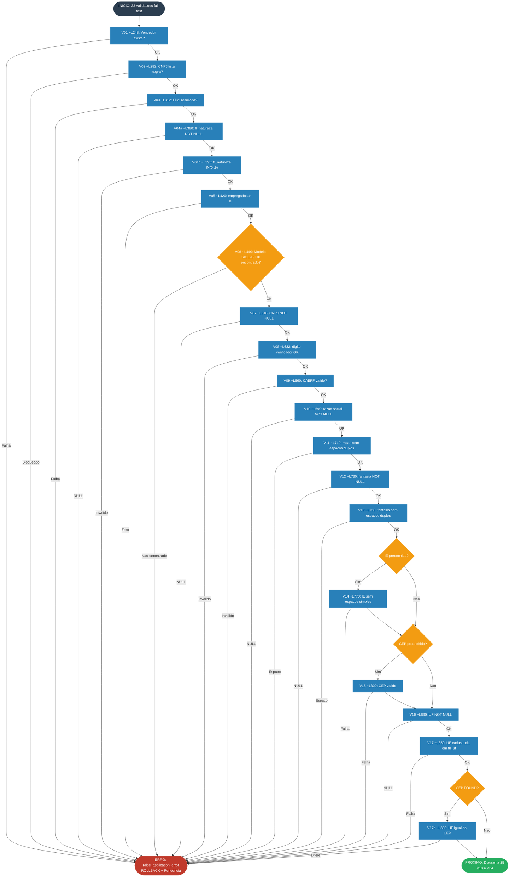

---

## Diagrama 2B — BC-02: Validacoes V18 a V34 (Camada 4 — parte 2)

> Continuacao do Diagrama 2A. Endereco completo + contato.

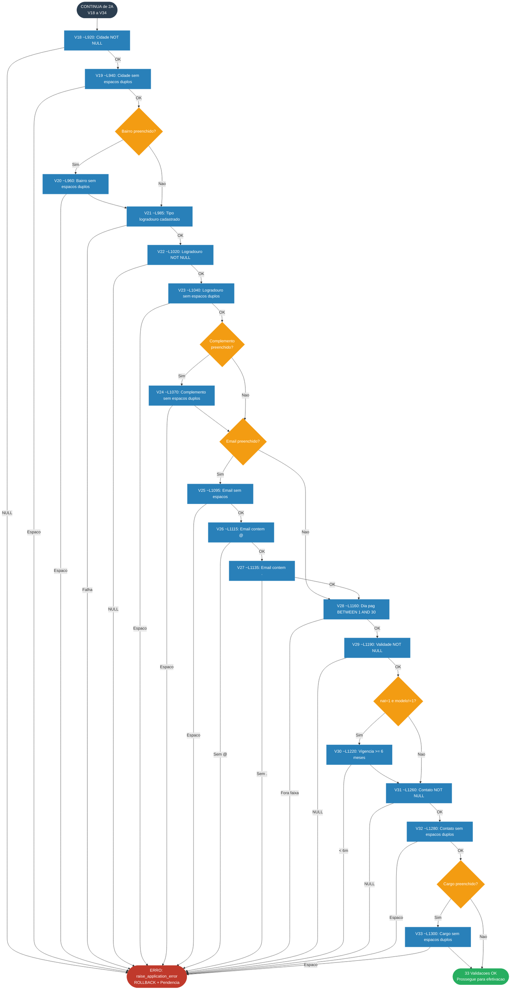

---

## Diagrama 3 — BC-06: Resolucao do Modelo de Negocio

> Bifurcacao SIGO x BITIX, coligada e calculo de canal de venda.

```mermaid
flowchart LR
    classDef cls-ini fill:#2c3e50,color:#fff,stroke:#2c3e50
    classDef cls-val fill:#2980b9,color:#fff,stroke:#2980b9
    classDef cls-dec fill:#f39c12,color:#fff,stroke:#f39c12
    classDef cls-erro fill:#c0392b,color:#fff,stroke:#c0392b
    classDef cls-ok fill:#27ae60,color:#fff,stroke:#27ae60

    START(["BC-06: Resolver Modelo de Negocio"]):::cls-ini

    BITIX_CH{"cd_operados\n= BITIX?"}:::cls-dec

    SIGO_COL["SIGO: Busca cod_contrato_mae\ntb_empresa_coligada"]:::cls-val
    SIGO_TOT{"Total coligada\nSIGO > 0?"}:::cls-dec
    SIGO_SOMA["nu_total = SUM(grupo SIGO)"]:::cls-val
    SIGO_IND["nu_total = individual"]:::cls-val
    SIGO_CUR["cursor cr_empresa_neg\n(filial, natureza, faixa)"]:::cls-val
    SIGO_OK{"cr_empresa_neg\n%FOUND?"}:::cls-dec

    BITIX_COL["BITIX: Busca cd_proposta_mae\ntb_empresa_coligada_bitx"]:::cls-val
    BITIX_TOT{"Total coligada\nBITIX > 0?"}:::cls-dec
    BITIX_SOMA["nu_total = SUM(grupo BITIX)"]:::cls-val
    BITIX_IND["nu_total = individual"]:::cls-val
    BITIX_CUR["cursor cr_empresa_neg_bitix\n(filial, natureza, faixa, dt_assinatura)"]:::cls-val
    BITIX_OK{"cr_empresa_neg_bitix\n%FOUND?"}:::cls-dec

    ERRO(["ERRO: fl_status=15\nnao encontrado parametros\nnatureza/filial/beneficiarios"]):::cls-erro

    CARGA["Carrega ~15 tabelas filhas\npor lnu_controle"]:::cls-val

    TAB_GER{"Tabela geral?\nmodelo != 1"}:::cls-dec
    TAB_S["lcd_tabela = lcd_tabela_saude\n(tabela compartilhada AFFIX)"]:::cls-val
    TAB_N["Nova tabela\n(criada em BC-07)"]:::cls-val

    CANAL["Calcula cd_canal_venda:\n1-29 -> PIM\n30-99 -> Middle Market\n>= 100 -> Grandes Contas"]:::cls-val

    CANAL_COL{"Coligada\nexiste?"}:::cls-dec
    CANAL_R["Recalcula canal pelo\ntotal consolidado do grupo"]:::cls-val

    FIM(["Modelo resolvido\nlnu_controle + lcd_tabela\n+ wcd_canal_venda"]):::cls-ok

    START --> BITIX_CH
    BITIX_CH -- "Nao (SIGO)" --> SIGO_COL --> SIGO_TOT
    SIGO_TOT -- "Sim" --> SIGO_SOMA --> SIGO_CUR
    SIGO_TOT -- "Nao" --> SIGO_IND --> SIGO_CUR
    SIGO_CUR --> SIGO_OK
    SIGO_OK -- "Nao" --> ERRO
    SIGO_OK -- "Sim" --> CARGA
    BITIX_CH -- "Sim (BITIX)" --> BITIX_COL --> BITIX_TOT
    BITIX_TOT -- "Sim" --> BITIX_SOMA --> BITIX_CUR
    BITIX_TOT -- "Nao" --> BITIX_IND --> BITIX_CUR
    BITIX_CUR --> BITIX_OK
    BITIX_OK -- "Nao" --> ERRO
    BITIX_OK -- "Sim" --> CARGA
    CARGA --> TAB_GER
    TAB_GER -- "Sim" --> TAB_S --> CANAL
    TAB_GER -- "Nao" --> TAB_N --> CANAL
    CANAL --> CANAL_COL
    CANAL_COL -- "Sim" --> CANAL_R --> FIM
    CANAL_COL -- "Nao" --> FIM
```

---

## Diagrama 4 — BC-01: Tratamento de Erros e Rollback

> Exception handler global, rollback, pendencia e erros pos-COMMIT.

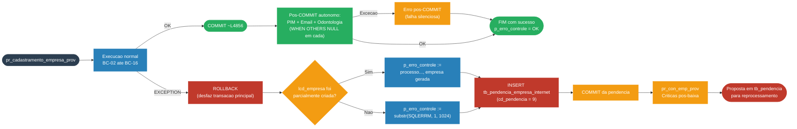

---

## Resumo: Ordem de Execucao por BC e Linha Aproximada

| Ordem | BC | Nome | Linha Aprox. | Subtipo |
|---|---|---|---|---|
| 1 | BC-01 | Geracao de lcd_empresa | ~241 | Core |
| 2 | BC-02 / BC-05 | Vendedor + Filial | ~248-376 | Supporting |
| 3 | BC-02 | Natureza e Empregados | ~380-440 | Supporting |
| 4 | BC-06 | Modelo de Negocio (SIGO ou BITIX) | ~440-618 | Core |
| 5 | BC-02 | CNPJ, Digito, CAEPF | ~618-690 | Supporting |
| 6 | BC-02 | Validacoes textuais e endereco | ~690-1320 | Supporting |
| 7 | BC-03 | Pessoa Juridica: tb_pessoa | ~1420-1490 | Supporting |
| 8 | BC-07 | Precificacao: tabelas de preco | ~1495-1760 | Core |
| 9 | BC-04 | Endereco e Comunicacao | ~3210-3520 | Supporting |
| 10 | BC-08 | Empresa Conveniada (~60 colunas) | ~1950-2450 | Core |
| 11 | BC-08 | Unidade, Parametros, Flags, Reajuste | ~2450-2800 | Core |
| 12 | BC-09 | Coparticipacao e Fatores | ~2800-4320 | Core |
| 13 | BC-10 | Carencia e Compra de Carencia | ~3730-3950 | Core |
| 14 | BC-11 | Fidelizacao (somente canal Middle) | ~3170-3200 | Supporting |
| 15 | BC-15 | Reembolso / Livre Escolha | ~4155-4320 | Supporting |
| 16 | BC-16 | Breakeven (70% hardcoded) | ~4599 | Supporting |
| 17 | BC-12 | Acesso Internet / Portal | ~4376-4650 | Generic |
| 18 | BC-16 | Minimo Contratual | ~4823-4855 | Supporting |
| 19 | BC-14 | Log de Sucesso (fl_status=9) | ~4847 | Generic |
| 20 | — | **COMMIT** | ~4856 | — |
| 21 | BC-18 | Desconto PIM (pos-COMMIT) | ~4770-4781 | Supporting |
| 22 | BC-17 | Notificacao Email (pos-COMMIT) | ~4676-4760 | Generic |
| 23 | BC-13 | Integracao Odontologica (pos-COMMIT) | ~4862-4920 | Supporting |

---

*Fluxograma gerado em: 2026-03-11*
*Baseado em: `REGRAS-DE-NEGOCIO-POR-CONTEXTO.md` (18 BCs, 152 regras, ~5.000 linhas PL/SQL)*
